# 引言

在操作系统课程中，学习以Unix/Linux为内核的操作系统的时候，
我们需要频繁使用 ls, grep, chmod, ps 等命令，并理解进程、文件权限等核心概念。但是，受日常使用限制，
同学们往往不会将Ubuntu系统等Linux发行版作为自己从主流操作系统进行使用，故而研究Linux的途中受到了阻碍。

部分同学会进行安装虚拟机等操作，但是由于其繁琐的下载镜像、配置虚拟机等操作往往会浪费掉很多时间
（虽然在某些情况下，使用虚拟机仍然是最优解）。

为了与时俱进和方便同学们学会并使用Linux的操作逻辑，**我们可以考虑使用Windows Linux 子系统（WSL）进行学习。**
好处在于，WSL与Windows是直接互通的，在传输文件方面非常方便，并且对于Linux中运行的服务程序，
也可以非常方便的使用本机地址访问到Linux内部。**此外，其轻量级，启动秒开，
完美兼容 Windows 文件系统也是一大优势，另外还可以方便使用docker容器。**

> **⚠️注意** 因为WSL直接与主机互通，对于某些危险的操作可能会影响主机，请酌情考虑是否使用此方式研究Linux。
>
> 另外，WSL使用了Hyper-V，如果你电脑上有VMware等虚拟机（旧版的）可能不兼容，如果出现问题，请尝试更新VMware，或者不要安装WSL。

# 安装要求

确保你的计算机符合如下条件：

- Windows 10及以上的系统（Windows 10 版本 2004 及更高版本）
- 设备支持虚拟化

> **⚠️注意** 安装由系统自动进行，并且只能按照在系统盘。

安装过程主要分为两大过程：

1. 启用WSL功能
2. 安装WSL子系统
3. 配置子系统

**第一步、第二步过程之间需要重启。**

官方教程参见：[https://learn.microsoft.com/zh-cn/windows/wsl/install](https://learn.microsoft.com/zh-cn/windows/wsl/install)

# 启用WSL功能

## 按下 Win + X 组合键，启动“终端管理员”、“Windows Powershell管理员”或“Powershell（管理员）”，如图。

| 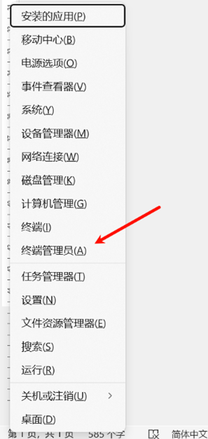 | 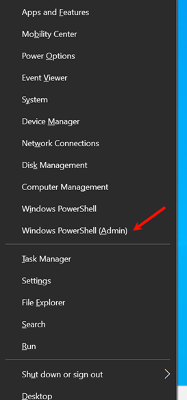 |
|-----------------------------|-----------------------------|

_“终端管理员”是Windows 11会显示的，而“Powershell（管理员）”是Windows 10 系统的。_

## 打开 Powershell

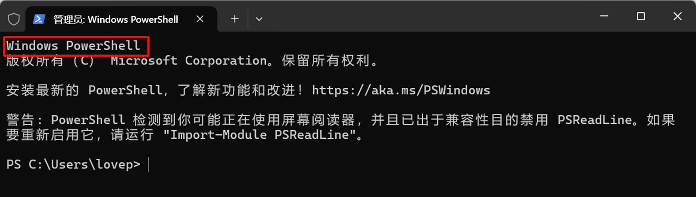

确保打开的是Powershell终端，如果界面不包含“Powershell”文本等类似的内容，
请切换到Powershell 终端（Windows 10不用操作这一步），按照如图点击：

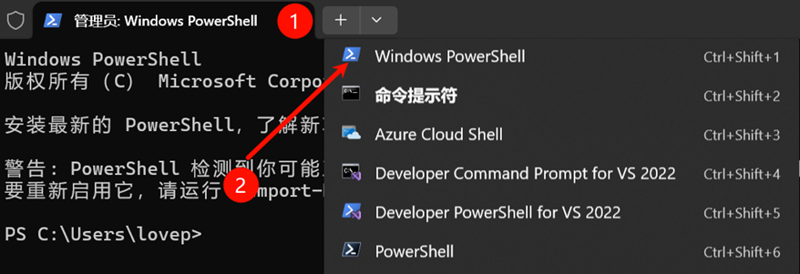

## 输入 “wsl --install”，并回车，等待系统启用 wsl 功能

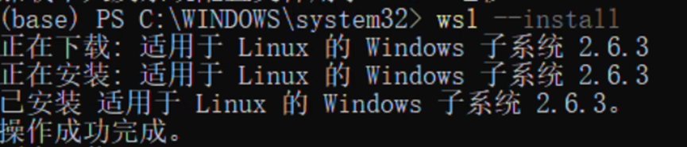

_此过程中会下载必要的组件，并进行安装_

## 重启系统

**上一步的操作，可能提示有所不同，最后会有英文的提示需要重启操作系统，请先进行重启。**

## 重新打开 Powershell，并输入 “wsl --list --online”

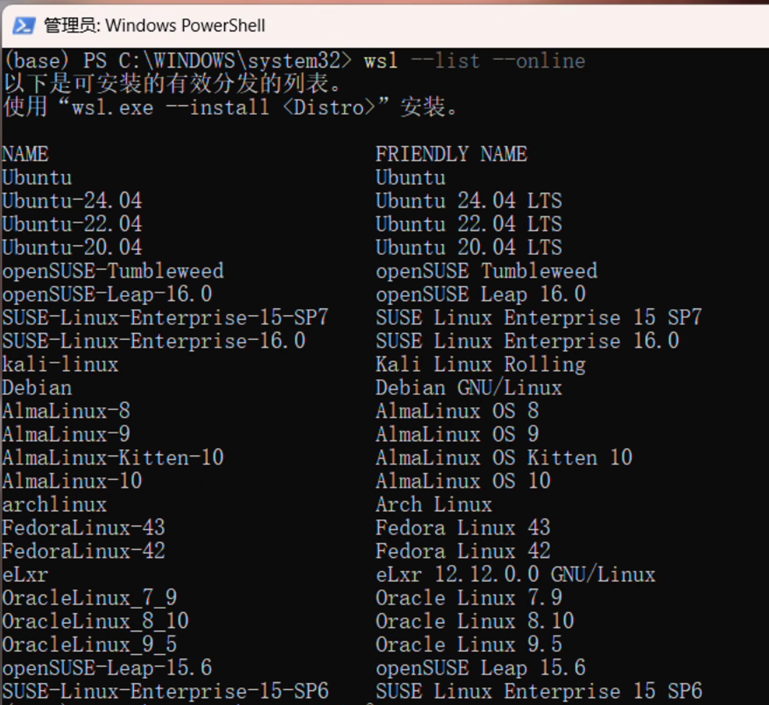

不出意外会出现上述的内容，上述内容NAME下方是各种Linux的分发版本，
常见的Linux分发系统都有，这里我们选择Ubuntu或者Ubuntu-24.04。

## 输入“wsl --install Ubuntu”或“wsl --install Ubuntu-24.04”并回车

这一步将会联网下载 Ubuntu 的镜像文件，并在你的系统上安装 Ubuntu 子系统。

_（可能会出现下载镜像超时的情况，如下图所示，这个时候需要科学上网，或者等一段时间，简称校园网发力了。）_

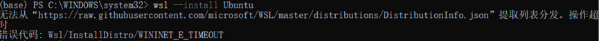

## 设置 Ubuntu 用户名与密码

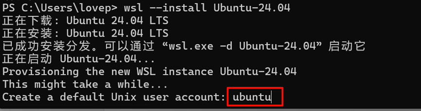

在子系统安装完成之后，会要求设置用户名和密码，
红框的地方不同同学的电脑上是不一样的，可以删除并输入一个想要的。然后按下回车键进行设置密码：

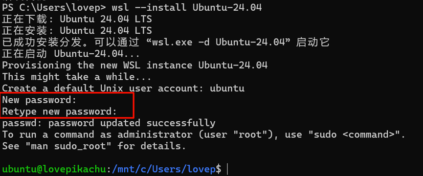

出现“New password”的时候，输入你想要设置的密码，输入密码的时候看不见，
输入完成之后回车，会提示再次输入，最后请记住你设置的密码，否则无法提权到root权限。

## 完成安装

出现类似于上图的清空（绿色文字+蓝色文字）的时候，
就代表子系统已经准备就绪，可以在这个终端中使用Ubuntu(Linux)的命令。如下图：

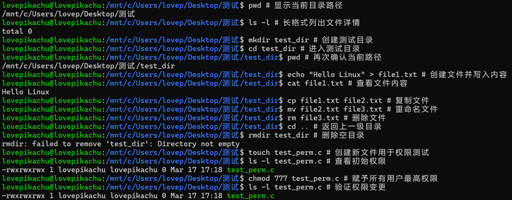

## 使用小贴士

### WSL有时不会跟随系统自动重启，安装之后Ubuntu子系统会以软件形式显示在开始菜单

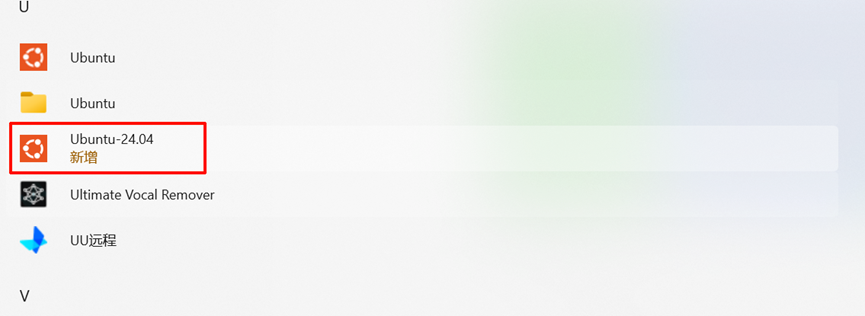

### 如果需要在特定目录打开wsl，可以在资源管理器上方输入“wsl”并回车

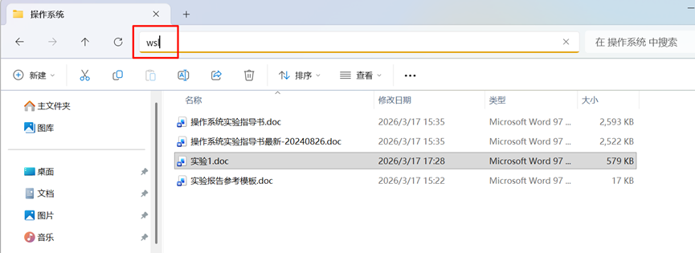

这样会在这个目录打开WSL终端，以操作文件。

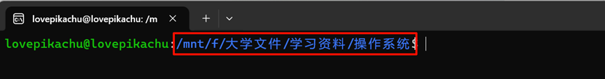

### 默认挂载的Windows系统盘在/mnt/下，可以使用 cd /mnt/ 盘符去到指定盘符。
### 建议在每次操作前使用 cd ~ 进入到Ubuntu的用户个人文件夹下进行文件操作，在Windows的挂载路径下无法使用到Linux的部分性质。
### 部分命令如cal没有安装，需要仔细查阅资料安装
### 在WSL Setting中，可以设置网络模式为Mirrored，这样可以让局域网中的电脑通过IP访问子系统中的服务，子系统中也可以通过本机地址访问到Windows上的服务。

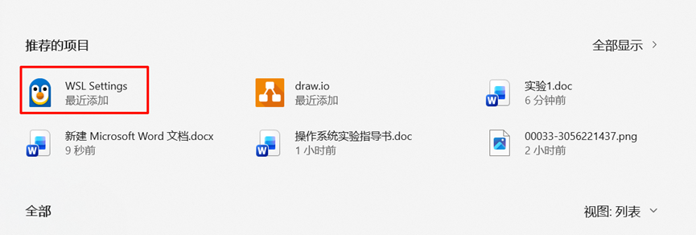

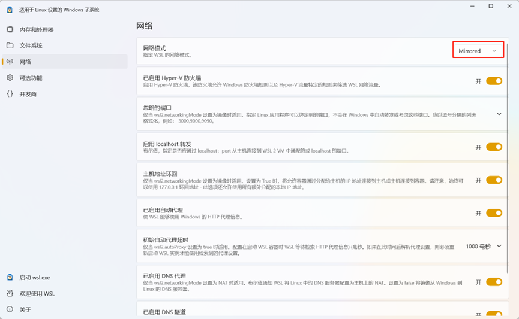

### **注意！root权限很危险，请不要随意在root权限下操作！**

# 卸载WSL

如果学习之后，不想要再使用WSL了，可以通过如下方式卸载：

## 打开Powershell（参考安装部分）
## 在Powershell中删除指定版本的子系统

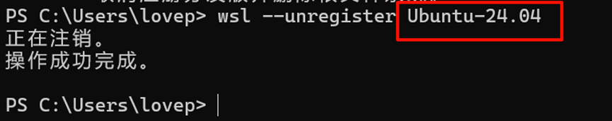

## 在Powershell中输入“wsl --uninstall”并回车即可

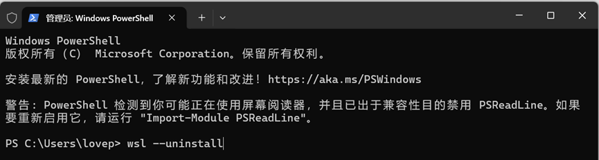

 